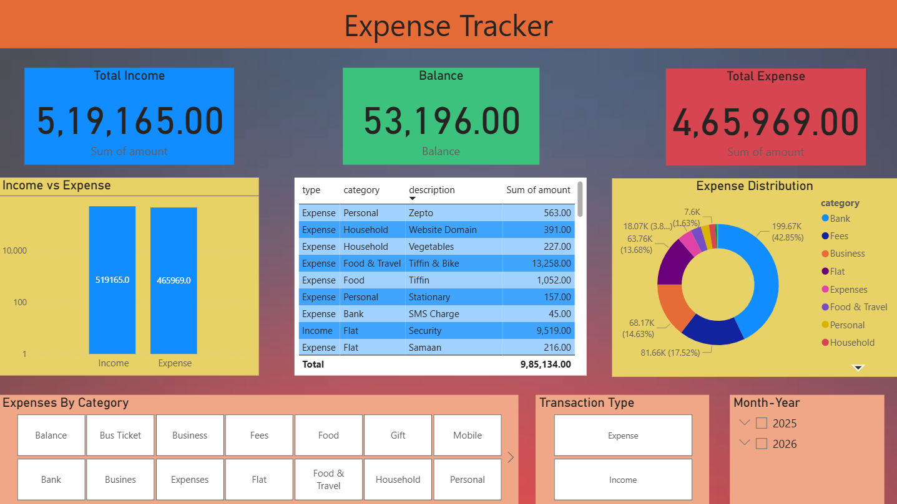

# Expense Tracker & Financial Dashboard

- Built an end-to-end expense tracking system using Python, SQLite, and Power BI
- Automated data storage and processing using a SQLite database
- Developed an interactive dashboard to analyze income, expenses, and spending trends
- Generated insights on category-wise spending and monthly financial patterns

## Dashboard Preview

[](dashboard/expense_tracker_dashboard.pbix)

## Problem Statement

Managing personal finances manually can be time-consuming, prone to errors, and challenging to analyze.
There is a need for a system that:
- Tracks transactions efficiently
- Categorizes income & expenses
- Provides clear financial insights

## Key Metrics

- Total Income
- Total Expenses
- Net Balance
- Category-wise Spending
- Monthly Trends
- Income vs Expense Comparison

## Tech Stack

- Python (Pandas, Numpy, Openpyxl)
- SQLite
- Power BI

## Project Structure

- 'src/' -> Python source files
- 'data/' -> Excel output  file
- 'dashboard/' -> Power BI dashboard

## Architecture

- Python Script -> SQLite Database -> Export (CSV/Excel) -> Power BI Dashboard -> Insights
## Key Insights

- Expenses are concentrated in specific categories like food, travel
- Monthly trends help identify overspending patterns
- Income vs Expense comparison highlights saving behaviour
- Category-level analysis enables better budgeting decisions

## How to Run

1. Clone the repository
2. Install dependencies
```
pip install -r requirements.txt
```
3. Run Python script:
```
python src/expense_tracker.py
```
4. Check the generated file in `data/`
5. Open the Power BI dashboard from `dashboard/expense_tracker_dashboard.pbix`

## Future Improvements

- Add Stereamlit/Web App interface
- Add budget prediction using ML
- User authentication system

## Author

Akshat Jain

Aspiring Data Analyst| Python| SQLite| Data Visualization

LinkedIn: https://www.linkedin.com/in/akshat-jain-934098250
